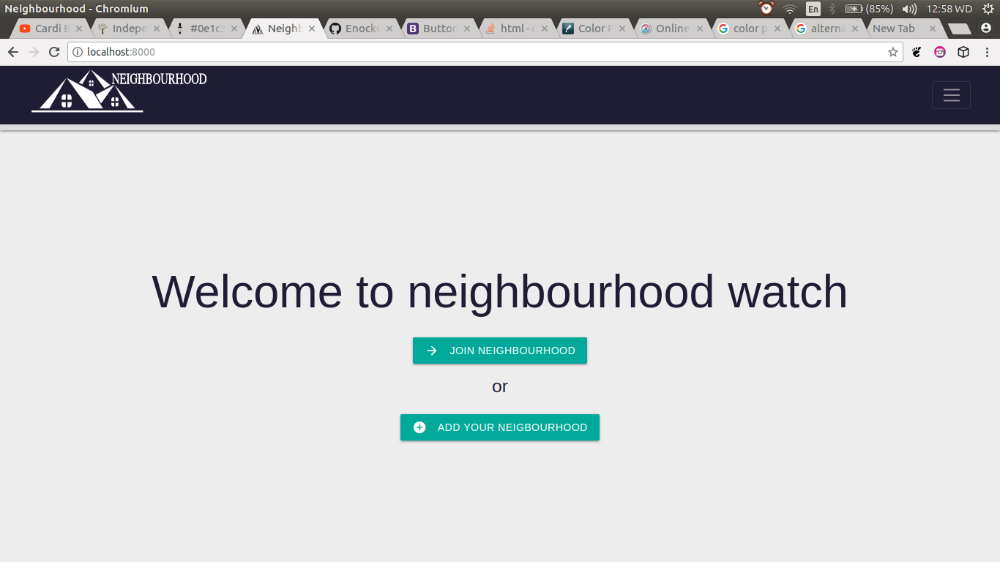

# NEIGHBOURHOODWATCH


This is a neighbourhood application that users can find businesses in their neighborhood. Find Contact Information for the health department and Police authorities near their neighborhood and also create Posts that will be visible to everyone in their neighborhood
## BY

****Enock OMONDI****

## Installation
`$ pip install -r requirements.txt`

### Requirements
* Linux
* Python 3.6 and up

## User Stories

* Sign in with the application to start using.
* Set up a profile about you and a general location and my neighborhood name.
* Find a list of different businesses in your neighborhood
* Create Posts that will be visible to everyone in my neighborhood
* view details of a single neighborhood

## Usage
```
Find a list of different businesses in your neighborhood
```
```
Find Contact Information for the  Police authorities near your neighborhoo
```

### Installing
```
Clone  from my github(https://github.com/EnockOMONDI/NEIGHBOURHOOD)
```
```
run pip > freeze -r requirements.txt to install dependencies
```
```
run python3.6 manage.py runserver to run app on local server
```


## Built With

* Django - The web framework used
* Python - Language
* materialize- Used for frontend
* Postgresql-Database
* Bootstrap4 - used for frontend

###### Deployment
* HEROKU

### KNOWN BUGS
- no known bugs

### Meta
-Feel free to add features (just fork it)
Incase of any queries, email me at -(djseanizellkenya@gmail.com)
<br>

## License
[MIT](https://choosealicense.com/licenses/mit/)
